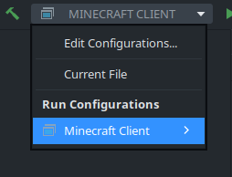
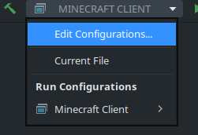
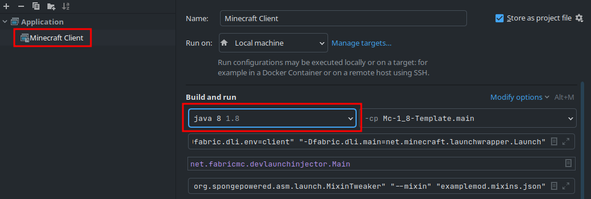

# Minecraft 1.8.9 Modding Template with Kotlin and Mixins

## Running Minecraft

*The dropdown menu should be in the top right of IntelliJ*

### 1. Generating the run configuration

Run the `genIntellijRuns` gradle task if you dont have a client run configuration.

### 2. Configuring the run configuration

🔴 If you don't do this you cannot launch Minecraft and will get this exception: 🔴
`java.lang.ClassCastException: class jdk.internal.loader.ClassLoaders$AppClassLoader cannot be cast to class java.net.URLClassLoader`

#### a) Open the configuration editor

#### b) Set java version to Java 8

## Package your mod as a JAR

To package your mod as a JAR file you have to run the `shadowJar` gradle task.
The `build` task will not work! The JAR will be in the build/libs directory.